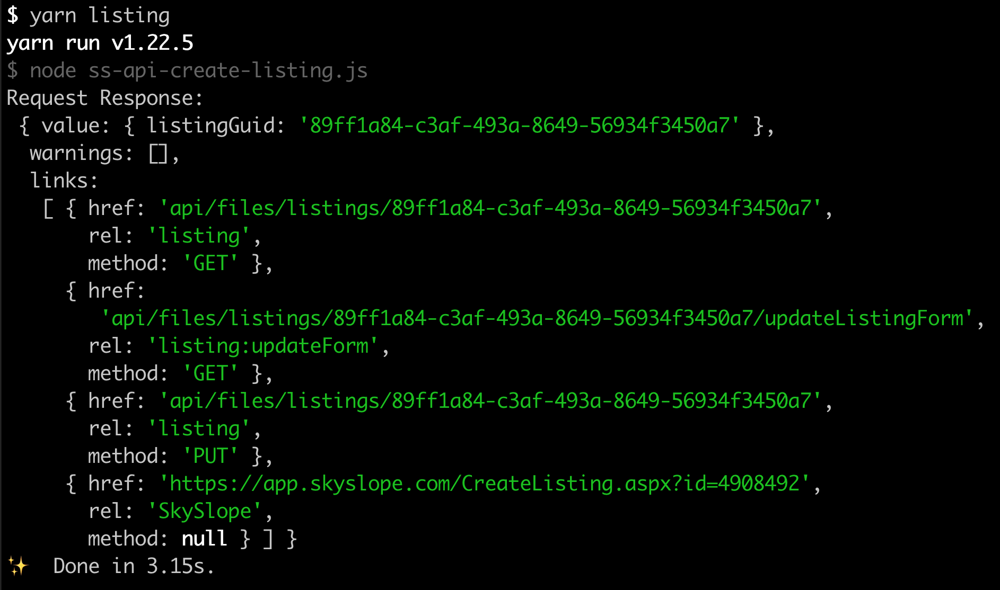

# file-creation-scripts
Scripts to generate dummy data for listings and sales in SkySlope

## Getting started
1. Make sure node and your preferred package manager are installed on your machine
    - Instruction to install Yarn can be found here [ [Mac](hhttps://classic.yarnpkg.com/en/docs/install#mac-stable), [Windows](https://classic.yarnpkg.com/en/docs/install#windows-stable) ]
    - Instructions to install Node.js and npm can be found [here](https://docs.npmjs.com/downloading-and-installing-node-js-and-npm)
2. Clone the repo `git clone https://github.com/skyslope/file-creation-scripts.git`
3. Replace the values in the .sampleENV file with your data and rename the file to `.env` from `.sampleENV`
4. Install the modules: dotenv, crypto, and axios: `yarn add dotenv crypto axios`
5. To generate a sale run: `yarn sale`
6. To generate a listing run: `yarn listing`
7. Each script returns a response object containing a `listingGuid` which you can use to view the file using either the GraphQL or Bulk Export Endpoints
    - The object also contains links that can be appended to `https://api.skyslope.com/` to retrieve:
        - the individual file, 
        - the required fields for the file, 
        - and the url for the file within the SkySlope UI
    - 

